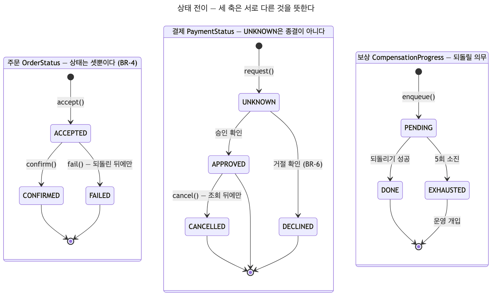
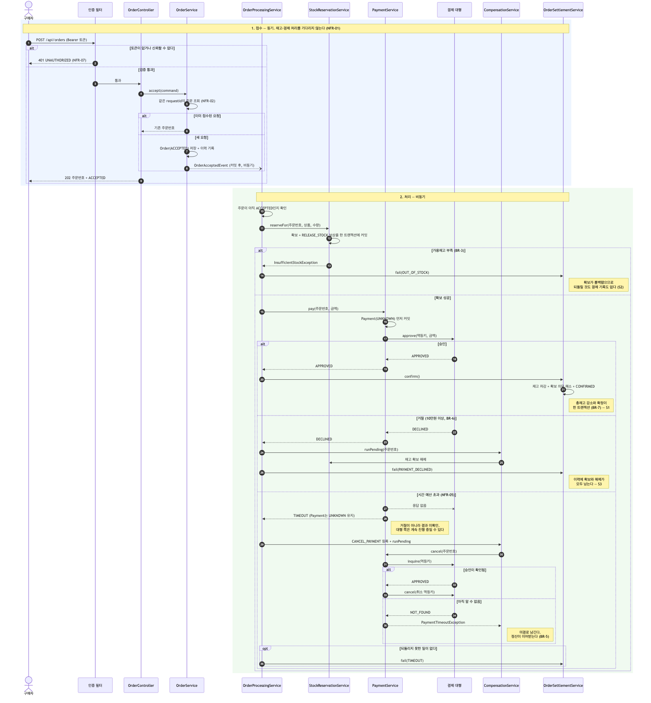
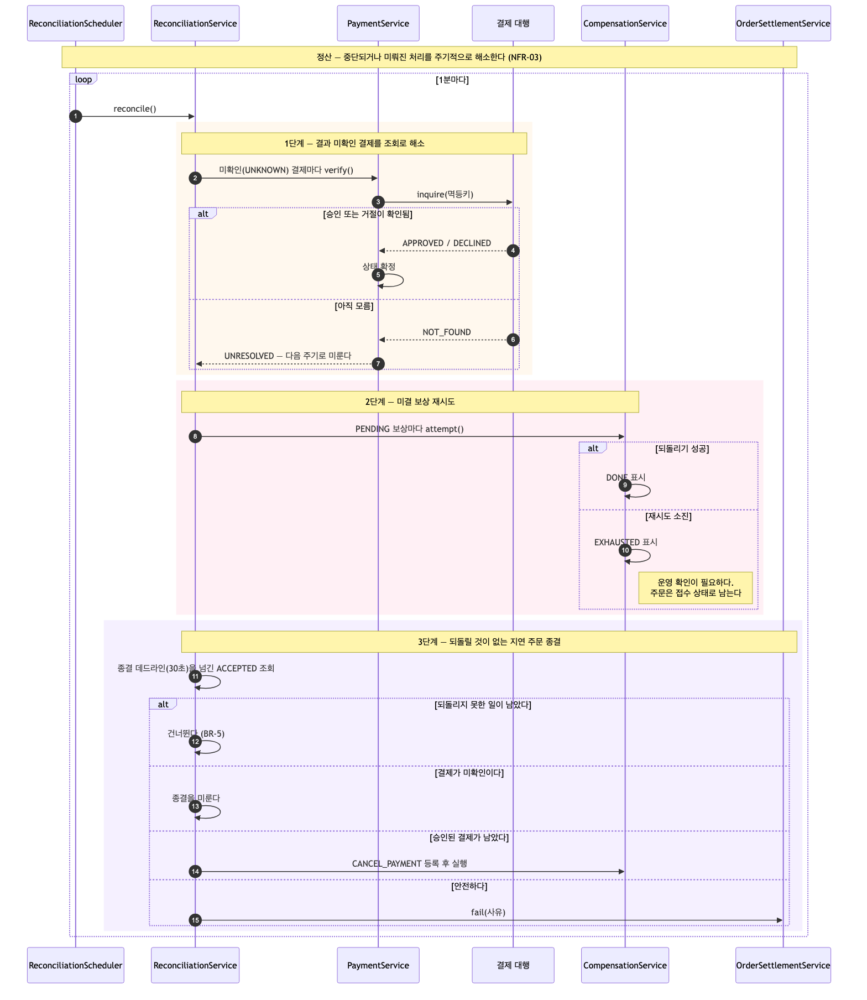

# 모놀리식 주문 처리 시스템

- [PRD](https://github.com/thought-corner/msa-architecture-prd)의 요구사항을 레이어드 아키텍처로 구현한 것이다.
- 이 저장소의 목적은 주문 시스템을 만드는 것이 아니다. **구조를 모놀리식에서 MSA로 바꿔도 관찰 가능한 결과가 같은지**를 확인할 기준선을 세우는 것이다.
- 그래서 기능보다 비기능 요구사항이 설계를 강제하고, 시나리오 S1~S3가 완료 기준이 된다.
- 용어는 [도메인 용어 사전](docs/product_requirements_document.md)에 고정돼 있다. 코드·테스트·커밋 메시지는 거기 있는 이름만 쓴다.

---

## 버전

단계가 하나 끝날 때마다 버전을 붙인다. **끝났다는 것은 구조가 바뀌었다는 뜻이 아니라,
바뀐 구조에서 아래가 그대로 통과한다는 뜻이다.**

| 버전 | 구조 | 상태 |
|---|---|---|
| **v1** | 모놀리식 — 도메인 모듈로 나눈 단일 배포 | 완결 |

### v1이 기준선인 이유

PRD 완료 기준의 마지막 항목이 *"구조를 바꾼 뒤에도 위 네 항목이 그대로 통과한다"* 이다.
그래서 v1은 "완성"이 아니라 **다음 단계가 깨뜨리면 안 되는 것의 목록**이다.

| 바뀌면 안 되는 것 | 확인 방법 |
|---|---|
| 시나리오 S1·S2·S3의 관찰 가능한 결과 | 시나리오 테스트 |
| 업무 규칙 BR-1 ~ BR-7 | 도메인 테스트 + 동시성 테스트 |
| API 계약 — 경로·상태 코드·응답 형태 | API 테스트 |
| 도메인 용어 | [사전](docs/product_requirements_document.md) |

**테스트는 구조를 모른다.** 결과 확인을 공개 조회(FR-08·09·10)로만 하고, 대기 조건을
경과 시간이 아니라 종결 상태 도달로 잡았다. 그래서 패키지를 옮기든 서비스를 쪼개든
같은 테스트가 그대로 돈다. 이것이 v1이 기준선일 수 있는 이유다.

### v1에 담긴 것

- FR-01 ~ FR-10 전부, BR-1 ~ BR-7 전부
- NFR-01·02·04·05·07·09 구현, NFR-03 부분
- 레이어드에서 시작해 **도메인 모듈로 재편**한 패키지 구조
- 결제 결과 미확인(in-doubt) 처리, 보상, 정산, 낙관적 락 재시도
- 테스트 76개 — 실제 MySQL에서

### v1이 남긴 숙제

다음 단계와 함께 풀 수도, 따로 풀 수도 있다. 어느 쪽이든 위 표는 그대로 지켜야 한다.

- NFR-06 추적ID, NFR-08 부하 측정 — 미착수
- 정산 동시 실행 보호 — 인스턴스가 둘이 되는 순간 필요해진다
- 스키마 마이그레이션 도구 — `ddl-auto: update`에 기대고 있다
- 토큰 발급의 자격 증명 확인

---

## 구조

```
com.study.monolithic_architecture
├── controller/       REST 엔드포인트, 예외 → HTTP 변환
│   └── dto/          웹 계약 (검증 애노테이션, JSON 형태)
├── service/          업무 흐름
│   ├── dto/          계층 간 데이터 (웹을 모른다)
│   └── compensation/ 보상 종류별 구현 (Strategy)
├── domain/           엔티티. 불변식을 스스로 지킨다
├── repository/       Spring Data JPA
├── constants/        상태·사유 enum
├── security/         JWT 발급과 검증
├── gateway/          결제 대행 인터페이스와 모사체
├── task/             스케줄 트리거
├── config/           설정과 빈
└── exception/        도메인 예외와 오류 응답
```

---

## 도메인별 로직

### 주문 (Order)

- 구매자가 상품 하나를 수량 1 ~ 10으로 사겠다는 한 건의 요청이다. (BR-1)
  - 접수는 **동기**, 처리는 **비동기**다. `accept()`가 주문을 저장하고 커밋한 뒤 `OrderAcceptedEvent`를 발행하면, `@TransactionalEventListener(AFTER_COMMIT)`가 비동기로 받아 처리를 시작한다.
  - 그래서 접수 응답은 재고·결제를 기다리지 않는다. (NFR-01)
- **상태는 셋뿐이다.** `ACCEPTED` → `CONFIRMED` 또는 `ACCEPTED` → `FAILED`. (BR-4)
- `PENDING`·`PROCESSING`·`COMPENSATING`을 두지 않는다. 되돌리는 중인지는 보상 축이 따로 표현한다.
- 종결 상태에서 되돌아가는 전이는 아예 없다. `requireAccepted()`가 메모리 안에서 막고, `@Version`이 트랜잭션 경계를 넘는 경합까지 잡는다.
- **멱등성**: 같은 `requestId`로 다시 들어오면 새로 만들지 않고 기존 주문을 돌려준다. (NFR-02)
- 동시에 들어온 중복은 `requestId`의 unique 제약이 막는다. 제약 위반은 **트랜잭션 밖에서** 받는다. 같은 트랜잭션 안에서 잡으면 이미 롤백 전용이라 재조회도 커밋도 할 수 없다.

### 상품과 재고 (Product)

- 재고를 **총재고**와 **확보수량** 두 값으로 관리한다. 가용재고는 저장하지 않고 계산한다.
- 확보는 총재고를 줄이지 않는다. 이것이 BR-7의 핵심이다.

| 시점 | 총재고 | 확정 수량 합 | 합계 |
|---|---|---|---|
| 초기 | 10 | 0 | 10 ✅ |
| 확보 직후 | 10 | 0 | 10 ✅ |
| 확정 후 | 9 | 1 | 10 ✅ |
| 원복 후 | 10 | 0 | 10 ✅ |

- 확보 시점에 총재고를 깎으면 확보와 확정 사이 구간에서 합이 초기 재고보다 작아진다.
- `총재고 + 확정된 주문의 수량 합 = 초기 재고`가 **어떤 시점에도** 성립해야 하므로 나눈다.
- 재고를 바꾸는 길은 `reserve` · `release` · `deduct` 셋뿐이다. setter를 두지 않는다.
- **확보와 되돌릴 의무는 한 트랜잭션에 함께 커밋한다.** 확보만 커밋해 두고 되돌릴 일을 나중에 등록하면, 그 사이 처리가 끊겼을 때 붙잡힌 재고를 아무도 되돌리지 못한다.
- 총재고와 확정 합은 그대로라 BR-7 검사는 통과하므로 조용히 샌다.
- 동시 확보는 `@Version` 낙관적 락이 막고, 충돌은 재시도한다. 재고 부족은 재시도하지 않는다. 몇 번을 해도 결과가 같은 결정적 실패다.

### 결제 (Payment)

- 결제 대행은 금액이 100,000원 이상이면 거절한다. (BR-6) 실패 경로를 언제든 재현하기 위한 규칙이다.
- **요청 사실을 먼저 커밋한 뒤 대행을 부른다.** 순서가 반대면 타임아웃이 났을 때 승인됐을지도 모르는 결제가 기록 없이 사라진다.
- `UNKNOWN`이 이 도메인의 핵심이다. 타임아웃은 **"거절됐다"가 아니라 "모른다"**이다. 대행 쪽 처리는 계속 진행 중일 수 있다.

```
타임아웃 → UNKNOWN 유지
        → 조회(inquire)로 사실 확인          ← 취소를 먼저 보내지 않는다
        ├ 승인 확인  → 취소(cancel) 발송
        ├ 거절 확인  → 되돌릴 것 없음
        └ 아직 모름  → 미결로 남기고 정산이 다시 묻는다
```

- 승인 이력이 없다는 응답을 거절로 단정하면, 뒤늦게 승인된 대금이 취소되지 않고 남는다.
- 모든 호출은 주문번호에서 결정적으로 파생한 **멱등키**를 갖는다. 승인 키와 취소 키는 별개이며, 재시도 사이에 절대 바뀌지 않는다.
- 대행 호출은 전용 실행자에서 돌린다. 공용 ForkJoinPool을 쓰면 타임아웃된 호출이 스레드를 계속 점유해 뒤이은 결제가 실제 지연과 무관하게 타임아웃 판정을 받는다. 대기열은 경계가 있고, 가득 차면 즉시 거부한다. 보내지 못한 것이 확실하므로 미확인이 아니라 확정된 실패다.

### 보상 (CompensationTask)

- 실패로 종결하기 전에 반드시 끝내야 하는 되돌리기 한 건이다. (BR-5)
- **트랜잭션 롤백이 아니다.** 확보는 이미 커밋됐으므로 새로운 행위로 되돌린다. 그래서 코드에 `rollback`이라는 이름을 쓰지 않는다.
- 종류별 구현은 `CompensationHandler` 인터페이스로 나뉜다. (Strategy) 보상 종류를 추가할 때 분기문을 열 필요가 없고, 기동 시점에 종류와 구현의 짝을 검사한다.
- `RELEASE_STOCK` — 붙잡아 둔 재고를 놓아준다
- `CANCEL_PAYMENT` — 승인된 결제를 되돌린다 (조회로 확인한 뒤에만)
- **소진은 "되돌렸다"가 아니라 "되돌리기를 포기했다"이다.** `EXHAUSTED`가 남아 있으면 주문을 종결하지 않는다. 그 상태로 닫으면 붙잡힌 재고가 영영 풀리지 않는다.
- 사람이 들여다볼 때까지 접수 상태로 남는 편이 옳다.
- 시도 기록·되돌리기·실패 판정은 각각 다른 트랜잭션이다. 한 트랜잭션에 묶으면 되돌리기가 실패할 때 재시도 횟수까지 롤백되어 영원히 소진되지 않는다.

### 정산 (Reconciliation)

- 중단되거나 미뤄진 처리를 1분마다 해소한다. (NFR-03)

1. **결과 미확인 결제** → 조회로 해소한다. 아직 모르면 다음 주기로 미룬다
2. **미결 보상** → 다시 시도한다
3. **되돌릴 것이 없는 지연 주문** → 실패로 종결한다

- 3단계는 안전할 때만 닫는다. 결제가 미확인이면 미루고, 승인이 남아 있으면 취소를 먼저 등록한다.
- 모른 채 닫으면 뒤늦은 승인이 취소되지 않고, 승인된 채 닫으면 취소가 나가지 않는다 — 둘 다 돈이 남는다.
- 트리거와 절차를 나눴다. `ReconciliationScheduler`는 **언제 도는지**만 알고, `ReconciliationService`는 **무엇을 하는지**만 안다. 덕분에 주기를 기다리지 않고 절차를 시험할 수 있다.

### 인증 (JWT)

- **주문 접수만** 막는다. 상품 조회는 인증 대상이 아니다. 주문이 멈춰도 상품 조회는 살아 있어야 하므로(NFR-04), 조회까지 잠그면 요구사항끼리 부딪힌다.
- 토큰이 없어도, 서명이 틀려도, 만료돼도 전부 401이다. 401은 "당신이 누구인지 모른다"이고 셋 다 같은 뜻이다. 어느 쪽인지 알려주면 공격자에게 정보를 준다.
- 경로 판정은 애플리케이션 기준 경로와 `PathPattern`으로 한다. `getRequestURI()`를 그대로 쓰면 컨텍스트 경로가 붙은 배포에서 인증이 통째로 꺼진 채 오류도 로그도 남지 않는다.

> `POST /api/auth/token`은 **자격 증명을 확인하지 않는다.** PRD §5에 비밀번호도 계정도 없어 확인할 대상이 없기 때문이다.
> 발급 수단이 없으면 주문 API를 쓸 수 없어 두었을 뿐이며, 이 지점은 요구사항이 정해지면 채워야 한다.

---

## 상태 전이



- 세 축은 서로 다른 것을 뜻하며 함께 움직인다.

| 축 | 무엇을 표현하는가 | 종결 |
|---|---|---|
| `OrderStatus` | 주문이 어떻게 끝났는가 | `CONFIRMED` / `FAILED` |
| `PaymentStatus` | 대금이 어떻게 됐는가 | `APPROVED` / `DECLINED` / `CANCELLED` |
| `CompensationProgress` | 되돌릴 의무가 어떻게 됐는가 | `DONE` / `EXHAUSTED` |

- 다이어그램에 그리지 않은 자기 전이가 셋 있다.
  - `ACCEPTED → ACCEPTED` — 되돌릴 일이 남아 있는 동안 주문은 여기에 머문다 (BR-5)
  - `UNKNOWN → UNKNOWN` — 조회가 `NOT_FOUND`면 판단을 미룬다
  - `PENDING → PENDING` — 시도가 실패해도 재시도가 남으면 머문다

---

## 흐름

### 주문 처리



### 정산



---

## API

| 메서드 | 경로 | 응답 | 근거 |
|---|---|---|---|
| `GET` | `/api/products` | 200 | FR-01 |
| `GET` | `/api/products/{id}` | 200 / 404 | FR-02 |
| `POST` | `/api/orders` | **202** / 400 / 401 | FR-03·04, NFR-07 |
| `GET` | `/api/orders/{orderNo}` | 200 / 404 | FR-08 |
| `GET` | `/api/orders?status=` | 200 / 400 | FR-09 |
| `GET` | `/api/orders/{orderNo}/histories` | 200 | FR-10 |
| `POST` | `/api/auth/token` | 200 | PRD 확장 |

- 접수에 202를 쓰는 이유는 받아들였을 뿐 확정이 아니기 때문이다. 확정 여부는 FR-08로 확인한다.

## 요구사항 대응

| | 상태 |
|---|---|
| **FR-01 ~ FR-10** | 전부 구현 · 검증 |
| **BR-1 ~ BR-7** | 전부 구현 · 검증 |
| **S1 · S2 · S3** | 자동 테스트 통과 |
| NFR-01 접수 200ms | 구조는 있으나 **3초 지연 주입 검증 없음** |
| NFR-02 멱등 | 구현 · 검증 |
| NFR-03 중단 정합성 | 정산으로 대부분 해소. **일부 경로 미검증** |
| NFR-04 장애 격리 | 인증 예외만 확인. **주문 중단 상태 검증 없음** |
| NFR-05 타임아웃 | 구현. **재현 테스트는 결제 대역 수준까지만** |
| NFR-06 추적ID | **미구현** |
| NFR-07 인증 | 구현 · 검증 |
| NFR-08 조회 100 TPS | **미측정** |
| NFR-09 명령 하나로 기동 | 구현 |