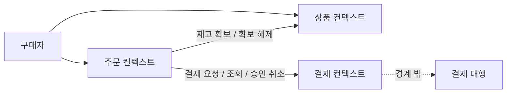
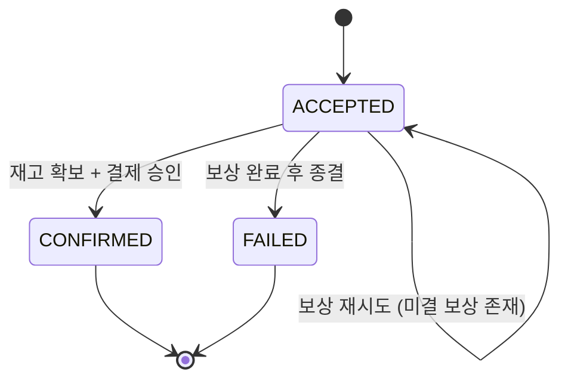
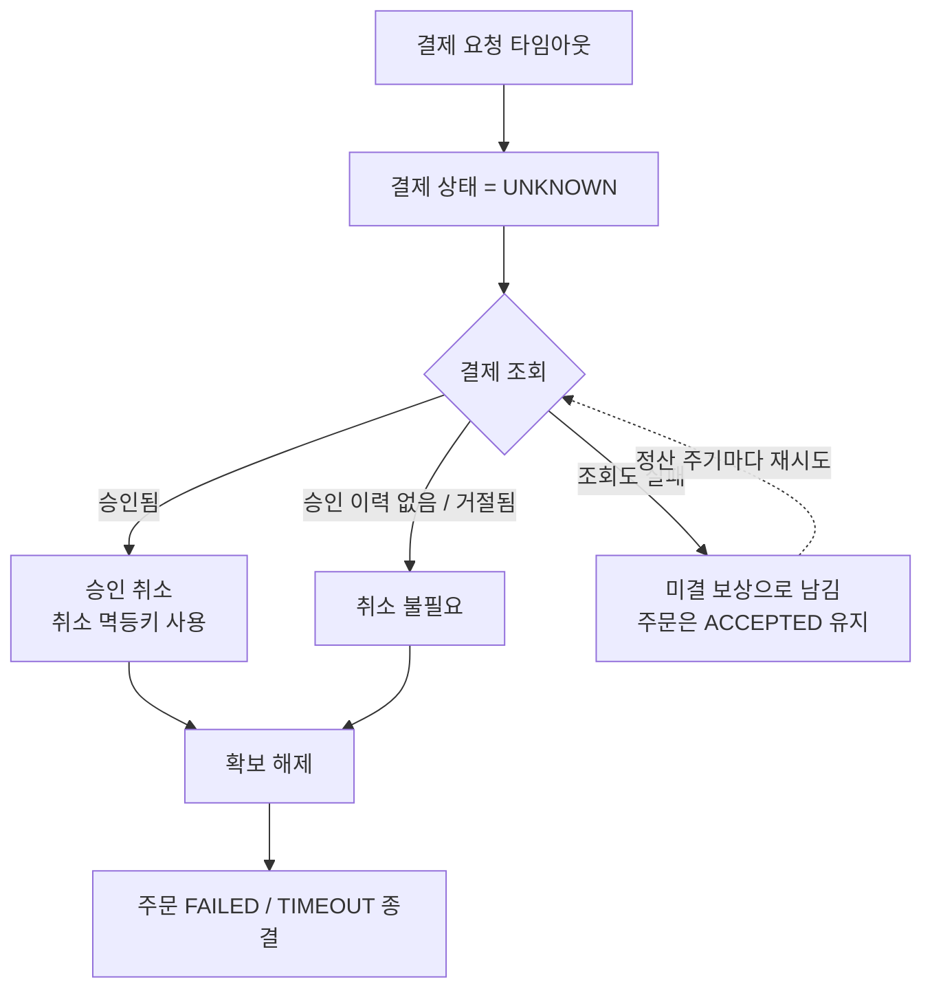

# 도메인 용어 사전 (Domain Dictionary)

> 근거 문서: [thought-corner/msa-architecture-prd](https://github.com/thought-corner/msa-architecture-prd)
>
> 이 사전은 구현보다 먼저 고정된다. 코드·테스트·API·커밋 메시지·이슈는 여기 있는 이름만 쓴다.
> 모놀리식에서 MSA로 구조를 바꿔도 **이름은 바뀌지 않는다.** 바뀌는 것은 이름이 사는 위치뿐이다.

---

## 0. 사용 규칙

1. **한 개념에 이름 하나.** 동의어를 발견하면 코드가 아니라 이 문서를 먼저 고친다.
2. **모든 용어는 근거를 갖는다.** 근거 열이 비어 있는 용어는 추가하지 않는다.
3. **한글은 대화·문서용, 영문은 코드 식별자용.** 둘은 1:1로 대응하며 임의로 늘리지 않는다.
4. **§7 금지어는 어디에도 쓰지 않는다.** 코드, PR 제목, 로그 메시지, 주석 전부 포함이다.
5. 용어를 늘리고 싶어지면 **"이 용어가 어떤 요구사항을 만족시키는가"에 먼저 답한다.** (PRD §5의 규칙을 그대로 따른다)
6. **PRD를 넘어서는 용어는 `PRD 확장`으로 표시한다.** 근거가 요구사항이 아니라 실무 관행일 때, 그 사실을 숨기지 않는다.

---

## 1. 바운디드 컨텍스트

지금은 하나의 배포 단위 안에 있지만, **경계는 지금 긋는다.** 나중에 쪼갤 때 이름이 흔들리지 않게 하기 위해서다.

| 컨텍스트 | 코드 식별자 | 책임 | 근거 |
| --- | --- | --- | --- |
| **주문** | `order` | 주문의 접수·상태 전이·이력·보상. 시스템의 유일한 오케스트레이터. | FR-03·04·08·09·10, BR-4 |
| **상품** | `product` | 상품 정보와 재고. 조회는 주문과 무관하게 살아 있어야 한다. | FR-01·02·05·07, BR-7, NFR-04 |
| **결제** | `payment` | 결제 승인·조회·취소. 결제 대행을 감싸는 유일한 통로. | FR-06·07, BR-6, NFR-05 |
| **결제 대행** | `paymentGateway` | 외부 시스템. 규칙 기반으로 모사한다. 도메인이 아니라 **경계 밖**이다. | PRD §1.1, BR-6 |



> **재고는 상품 컨텍스트 안에 둔다 (Q2 결정).** PRD §5가 재고수량을 상품의 필드로 두고, 분리를 요구하는 요구사항이 없다.
> 분리는 재고 쓰기 경합이 상품 조회(NFR-08)를 실제로 방해할 때 검토한다. **그 전까지 컨텍스트를 늘리지 않는다.**

---

## 2. 액터

| 한글 용어 | 코드 식별자 | 정의 | 근거 |
| --- | --- | --- | --- |
| **구매자** | `Buyer` | 상품을 조회하고 주문을 넣는 유일한 사용자. 인증된 요청으로만 주문한다. | PRD §1.1, NFR-07 |
| **운영자** | `Operator` | 상품·재고 초기 데이터를 넣는 주체. 화면 없이 초기 데이터로 대체한다. | PRD §1.1 |
| **결제 대행** | `PaymentGateway` | 승인·취소를 응답하는 외부 시스템. 실제 연동 없이 모사한다. | PRD §1.1, BR-6 |

---

## 3. 핵심 도메인 개념

### 3.1 주문

| 한글 용어 | 코드 식별자 | 정의 | 근거 |
| --- | --- | --- | --- |
| **주문** | `Order` | 구매자가 상품 하나를 수량 1~10으로 사겠다는 한 건의 요청. | BR-1 |
| **주문 접수** | `accept` / `ACCEPTED` | 요청이 유효해 시스템이 받아들인 상태. **아직 확정이 아니다.** | PRD §1.2, FR-03 |
| **주문 확정** | `confirm` / `CONFIRMED` | 재고가 확보되고 결제까지 승인된 최종 상태. | PRD §1.2 |
| **주문 실패** | `fail` / `FAILED` | 원복까지 끝나고 종결된 상태. **원복 전에는 실패가 아니다.** | BR-5 |
| **종결 상태** | terminal status | `CONFIRMED` \| `FAILED`. 여기서 되돌아가지 않는다. | BR-4 |
| **주문 금액** | `orderAmount` | `상품 가격 × 수량`. 할인·배송비 없음. | BR-2 |

> **주문에는 항목(Item/Line) 개념이 없다.** BR-1이 1주문 1상품을 못 박았으므로 `OrderItem`·`OrderLine` 같은 타입을 만들지 않는다. 상품ID와 수량은 `Order`의 필드다.
>
> **원복이 끝나지 않은 주문은 `ACCEPTED`에 머문다.** BR-4는 상태를 셋만 허용하고 BR-5는 원복 완료 전 종결을 금지한다. 둘을 동시에 지키는 방법은 상태를 늘리는 것이 아니라, 원복 진행 상황을 **별도 축(§3.5 보상 작업)** 으로 두는 것뿐이다.

### 3.2 상품과 재고

| 한글 용어 | 코드 식별자 | 정의 | 근거 |
| --- | --- | --- | --- |
| **상품** | `Product` | 이름·가격·재고를 가진 판매 대상. | FR-01, FR-02 |
| **총재고** | `stockQuantity` | 상품이 실제로 보유한 수량. PRD §5의 `재고수량`. **BR-7 좌변.** | BR-7 |
| **확보수량** | `reservedQuantity` | 아직 종결되지 않은 주문이 붙잡고 있는 수량. | PRD §1.2 |
| **가용재고** | `availableQuantity` | `총재고 - 확보수량`. 새 주문이 실제로 쓸 수 있는 양. **저장하지 않는 계산값이다.** | BR-3 |
| **재고 확보** | `reserve` | 해당 수량을 다른 주문이 쓰지 못하게 붙잡아 두는 행위. **총재고를 줄이지 않는다.** | PRD §1.2, FR-05 |
| **확보 해제** | `release` | 붙잡아 둔 수량을 놓아주는 행위. 실패 시 재고 원복의 실체. | FR-07, BR-5 |
| **재고 차감** | `deduct` | 확정 시점에 총재고를 실제로 줄이는 행위. **확정에서 단 한 번만 일어난다.** | S1 |
| **재고 정합성** | stock invariant | `총재고 + 확정된 주문의 수량 합 = 초기 재고`. 어떤 시점에도 성립한다. | BR-7 |

> **왜 확보와 차감을 나누는가**: 확보가 총재고를 곧바로 줄이면, 확보와 확정 사이 구간에서 `총재고 + 확정합 < 초기재고`가 되어 BR-7이 순간적으로 깨진다. 확보를 별도 수량으로 두면 아래 모든 시점에서 불변식이 정확히 성립한다.
>
> | 시점 | 총재고 | 확정 수량 합 | 합계 |
> | --- | --- | --- | --- |
> | 초기 | 10 | 0 | 10 ✅ |
> | 확보 직후(미확정) | 10 | 0 | 10 ✅ |
> | 확정 후 (S1) | 9 | 1 | 10 ✅ |
> | 결제 거절·원복 후 (S3) | 10 | 0 | 10 ✅ |
>
> **PRD §5에 더해지는 저장 필드는 `확보수량` 하나뿐이다 (Q1 결정).** 가용재고는 계산값이고, 확보·해제·차감은 필드가 아니라 행위다.

### 3.3 결제

| 한글 용어 | 코드 식별자 | 정의 | 근거 |
| --- | --- | --- | --- |
| **결제** | `Payment` | 한 주문에 대한 한 건의 대금 처리 기록. | PRD §5 |
| **결제 요청** | `requestPayment` | 결제 대행에 승인을 요청하는 행위. | FR-06 |
| **결제 조회** | `verify` | 결제 대행에 **실제 결과가 무엇인지 되묻는** 행위. 타임아웃 이후의 첫 조치다. | NFR-05 (PRD 확장) |
| **결제 승인** | `APPROVED` | 결제 대행이 대금을 승인한 상태. | FR-06 |
| **결제 거절** | `DECLINED` | 결제 대행이 거절한 상태. 금액 100,000원 이상이면 거절한다. | BR-6 |
| **승인 취소** | `cancel` / `CANCELLED` | 이미 승인된 결제를 되돌리는 행위. **거절과 다르다.** | FR-07 |
| **결과 미확인** | `UNKNOWN` | 요청은 보냈으나 결과를 받지 못한 상태. 승인됐을 수도, 아닐 수도 있다. | NFR-05 (PRD 확장) |

> **`UNKNOWN`은 PRD §5에 없는 상태다.** 그럼에도 두는 이유: 타임아웃 시점에 `APPROVED`·`DECLINED`·`CANCELLED` 중 어느 것도 사실이 아니다. 이를 표현하지 못하면 **무엇을 조회하고 무엇을 취소해야 하는지 특정할 수 없다.** 결제 연동에서 in-doubt 상태를 두지 않는 설계는 실무에서 그대로 미결 건 누락으로 이어진다.
>
> `UNKNOWN`은 **종결 상태가 아니다.** 조회로 반드시 `APPROVED` 또는 `DECLINED`로 해소된다.

### 3.4 이력

| 한글 용어 | 코드 식별자 | 정의 | 근거 |
| --- | --- | --- | --- |
| **상태 이력** | `OrderStatusHistory` | 주문이 언제·어떤 상태로·왜 바뀌었는지의 기록. | FR-10 |
| **전이 사유** | `reason` | 상태가 바뀐 까닭. 실패 사유보다 넓은 개념이며 성공 경로도 기록한다. | FR-10, S3 |

### 3.5 보상 (PRD 확장)

BR-5를 지키려면 "원복이 아직 안 끝난 주문"을 표현할 수단이 필요하다. 주문 상태를 늘리는 대신 별도 개념으로 둔다.

| 한글 용어 | 코드 식별자 | 정의 | 근거 |
| --- | --- | --- | --- |
| **보상 작업** | `CompensationTask` | 실패로 종결하기 전에 반드시 끝내야 하는 되돌리기 한 건. | BR-5 |
| **미결 보상** | pending compensation | 아직 성공하지 못한 보상 작업. 이게 남아 있는 한 주문은 `ACCEPTED`다. | BR-5, BR-7 |
| **정산** | `reconciliation` | 미결 보상을 주기적으로 다시 시도해 해소하는 과정. | NFR-03 |

---

## 4. 상태 어휘

같은 개념을 문서에서는 한글로, 코드에서는 아래 상수로만 부른다. **중간 표현을 만들지 않는다.**

### 4.1 주문 상태 `OrderStatus`

| 한글 | 코드 | 종결 여부 |
| --- | --- | --- |
| 접수됨 | `ACCEPTED` | 아니오 |
| 확정됨 | `CONFIRMED` | 예 |
| 실패함 | `FAILED` | 예 |



> `PENDING`, `PROCESSING`, `COMPLETED`, `CANCELLED`, `COMPENSATING` 같은 상태는 **없다.** BR-4가 세 개만 허용한다.

### 4.2 결제 상태 `PaymentStatus`

| 한글 | 코드 | 종결 여부 | 비고 |
| --- | --- | --- | --- |
| 결과 미확인 | `UNKNOWN` | 아니오 | PRD 확장. 조회로 해소한다 |
| 승인됨 | `APPROVED` | 예 | |
| 거절됨 | `DECLINED` | 예 | 승인된 적이 없다 |
| 취소됨 | `CANCELLED` | 예 | 승인된 것을 되돌렸다 (`CANCELED` 철자 금지) |

### 4.3 실패 사유 `FailureReason`

| 코드 | 뜻 | 발생 지점 | 회복 | 근거 |
| --- | --- | --- | --- | --- |
| `OUT_OF_STOCK` | 가용재고가 요청 수량보다 적다 | FR-05 | 부수효과 없음 | FR-05, BR-3 |
| `PAYMENT_DECLINED` | 결제 대행이 거절했다 | FR-06 | FR-07 | FR-06, BR-6 |
| `TIMEOUT` | 결제 대행이 시간 예산 안에 응답하지 않았고, 조회 결과 승인되지 않았거나 승인분을 취소했다 | FR-06 | FR-07 | FR-06 + NFR-05 |

> 실패 사유는 **주문이 실패했을 때만** 값을 갖는다. 성공한 주문의 실패 사유는 값이 없다.
> `TIMEOUT`은 **보상이 끝난 뒤에야** 붙는다. 타임아웃이 났다는 사실만으로 붙이지 않는다.
>
> **`TIMEOUT`은 새 기능이 아니라 FR-06의 두 번째 실패 경로다 (Q5 결정).** 회복은 이미 FR-07이, 시간 판정은 NFR-05가 규정한다.
> **따라서 FR을 추가하지 않는다.** PRD 본문을 굳이 손댄다면 FR-06 수용 기준에 한 문장을 더하는 것으로 족하다.

---

## 5. 식별자

혼동이 가장 잦은 자리다. 서로 다른 것이며 대체할 수 없다.

| 한글 용어 | 코드 식별자 | 누가 만드는가 | 무엇에 쓰는가 | 근거 |
| --- | --- | --- | --- | --- |
| **주문번호** | `orderNo` | 시스템 | 주문 한 건을 가리킨다. 외부에 노출되는 주문의 이름. | FR-03, FR-08 |
| **요청식별자** | `requestId` | 클라이언트 | 같은 요청인지 판별한다. 같은 값이면 주문을 새로 만들지 않는다. | NFR-02 |
| **추적ID** | `traceId` | 시스템 | 한 주문의 처리 로그를 처음부터 끝까지 잇는다. | NFR-06 |
| **승인 멱등키** | `paymentIdempotencyKey` | 시스템 | 같은 주문의 결제 승인이 두 번 일어나지 않게 한다. `orderNo`에서 파생. | NFR-05 (PRD 확장) |
| **취소 멱등키** | `cancelIdempotencyKey` | 시스템 | 같은 결제의 취소가 두 번 일어나지 않게 한다. `orderNo:cancel`에서 파생. | FR-07 (PRD 확장) |

> **`orderId`와 `orderNo`를 섞지 않는다.** 저장소 내부 키가 필요하면 `id`로 두고, 도메인·API에서는 `orderNo`만 쓴다.
>
> **멱등키는 재시도 사이에 절대 바뀌지 않는다.** 재시도마다 새 UUID를 만들면 멱등성이 사라지고 이중 승인이 난다. 키는 주문번호에서 **결정적으로 파생**한다.

---

## 6. 행위 용어

동사를 통일한다. 같은 일에 두 개의 동사를 쓰지 않는다.

| 한글 | 코드 | 대상 | 뜻 |
| --- | --- | --- | --- |
| 접수하다 | `accept` | 주문 | 유효한 요청을 받아들이고 주문번호를 돌려준다 |
| 확정하다 | `confirm` | 주문 | 재고 차감과 결제 승인이 모두 끝났음을 종결한다 |
| 실패시키다 | `fail` | 주문 | 보상이 끝난 뒤 실패로 종결한다 |
| 확보하다 | `reserve` | 재고 | 수량을 붙잡아 둔다 |
| 해제하다 | `release` | 재고 | 붙잡아 둔 수량을 놓아준다 |
| 차감하다 | `deduct` | 재고 | 총재고를 실제로 줄인다 (확정 시 1회) |
| 요청하다 | `requestPayment` | 결제 | 결제 대행에 승인을 요청한다 |
| 조회하다 | `verify` | 결제 | 결제 대행에 실제 결과를 되묻는다 |
| 취소하다 | `cancel` | 결제 | 승인된 결제를 되돌린다 |
| **원복하다** | `compensate` | 주문 | 실패한 주문이 만든 부수효과(`release` + `cancel`)를 모두 되돌린다 |

> **원복은 트랜잭션 롤백이 아니다.** 이미 커밋되었거나 외부 시스템에 반영된 결과를 **새로운 행위로** 되돌리는 것이다. 코드에서 `rollback`이라는 이름을 쓰지 않는 이유다.
>
> **`release`·`cancel`·`compensate`는 전부 멱등이다.** 이미 해제된 재고를 다시 해제하거나 이미 취소된 결제를 다시 취소하는 것은 **오류가 아니라 성공**이다.

---

## 7. 금지어 · 혼동 주의

| 쓰지 않는 말 | 대신 쓰는 말 | 왜 |
| --- | --- | --- |
| 주문 취소 | 주문 **실패** | BR-4에 취소 상태가 없다. 취소는 결제에만 있다 |
| 롤백 / `rollback` | 원복 / `compensate` | DB 트랜잭션 되돌리기와 다른 개념이다 |
| 환불 / `refund` | 승인 취소 / `cancel` | 정산 이후의 환불은 이 시스템의 범위 밖이다 |
| 주문 생성 / `create` | 주문 접수 / `accept` | 접수는 "받아들였을 뿐 확정은 아니다"를 담는다 |
| 주문 완료 | 주문 **확정** | "완료"는 접수 완료인지 확정인지 구분되지 않는다 |
| 재고 감소 / 재고 차감 (확보 지점에서) | 재고 **확보** | 확보는 총재고를 줄이지 않는다 (§3.2) |
| `PENDING` / `PROCESSING` / `COMPENSATING` | `ACCEPTED` | BR-4가 허용하는 상태는 셋뿐이다 |
| **"타임아웃 = 결제 실패"** | **결과 미확인 (`UNKNOWN`)** | 타임아웃은 승인 여부를 모른다는 뜻이지 거절됐다는 뜻이 아니다 |
| 사용자 / 고객 / `User` / `Customer` | 구매자 / `Buyer` | 액터는 하나다 |
| 물품 / 아이템 / `Item` / `Goods` | 상품 / `Product` | |
| `OrderItem` / `OrderLine` | (만들지 않는다) | BR-1: 1주문 1상품 |
| `CANCELED` | `CANCELLED` | 철자를 하나로 고정한다 |

---

## 8. 타임아웃 처리 규약 (Q3 결정)

> **결정**: 타임아웃은 실패가 아니라 **결과 미확인**이다. 취소를 먼저 보내지 않고 **조회로 사실을 확인한 뒤** 필요한 경우에만 취소한다. 모든 외부 호출은 멱등키를 갖는다.

### 8.1 처리 순서



### 8.2 규칙

| # | 규칙 | 이유 |
| --- | --- | --- |
| R-1 | 타임아웃 직후 **조회를 먼저** 한다. 취소를 곧바로 보내지 않는다. | 승인된 적 없는 건을 취소하면 PG 오류가 나고, 진짜 승인된 건을 놓친다 |
| R-2 | 승인 요청과 취소 요청은 **각자의 멱등키**를 갖는다. 키는 `orderNo`에서 결정적으로 파생한다. | 재시도가 이중 승인·이중 취소를 만들지 않는다 |
| R-3 | **이미 취소됨 / 승인 이력 없음** 응답은 **성공**으로 판정한다. | 이것이 멱등성의 실체다. 오류로 다루면 무한 재시도에 빠진다 |
| R-4 | `DECLINED`와 4xx는 **재시도하지 않는다.** 타임아웃·연결 오류·5xx만 재시도한다. | 결정적 거절(BR-6)을 재시도하면 응답만 늦어진다 |
| R-5 | 보상이 실패하면 **미결 보상**으로 남기고 주문은 `ACCEPTED`를 유지한다. | BR-5: 원복 전에 실패로 종결하지 않는다 |
| R-6 | 미결 보상은 **정산이 유한 횟수 재시도**하고, 소진되면 운영 개입 대상으로 표시한다. | 무한 재시도는 장애를 증폭시킨다 |
| R-7 | 미결 보상이 남아 있어도 **BR-7은 깨지지 않는다.** 확보는 살아 있고 총재고는 그대로다. | 확보/차감 분리(§3.2)가 여기서 값을 한다 |

---

## 9. 시간 예산 (Q4 결정)

> **결정**: 시간은 **계층으로 쌓되 안쪽이 항상 바깥쪽보다 짧다.** 테스트가 기다리는 시간은 시스템의 데드라인과 **다른 숫자**이며, 테스트는 데드라인을 정의하지 않고 **관측만** 한다.

### 9.1 예산 표

값을 **설정**으로 둘지 **상수**로 둘지는 두 질문으로 가른다.

1. 이 값이 바뀌면 그것은 배포 설정 변경인가, 요구사항 변경인가? → 요구사항 변경이면 상수다.
2. 운영이 이 값을 실제로 조정하는가? → 아니라면 설정으로도 만들지 않는다.

| 이름 | 어디에 두는가 | 값 | 근거 |
| --- | --- | --- | --- |
| 접수 응답 상한 | (검증 기준) | 200ms (p99) | NFR-01 |
| **결제 응답 타임아웃** | 설정 `order.payment-timeout` | 5s | 외부 시스템 상태에 따라 달라진다 (NFR-05) |
| **정산 주기** | 설정 `order.reconciliation-interval` | 1m | 부하에 따라 조정한다 (R-6) |
| **주문 종결 데드라인** | 상수 `ReconciliationService.SETTLEMENT_DEADLINE` | 30s | 시험은 Clock으로 하고, 독립적으로 바뀌면 §9.2가 깨진다 |
| **보상 최대 시도** | 상수 `CompensationService.MAX_ATTEMPTS` | 5 | 정책 숫자. 바꾸려면 설계 판단이 필요하다 (R-6) |
| 결제 대행 거절 기준액 | 상수 `SimulatedPaymentGateway.DECLINE_THRESHOLD` | 100,000원 | **업무 규칙이다** (BR-6) |
| 주문 수량 범위 | 상수 `Order.MIN_QUANTITY` / `MAX_QUANTITY` | 1~10 | **업무 규칙이다** (BR-1) |
| 결제 대행 응답 지연 | 테스트 대역 | — | 운영이 쓰지 않는 값이다 (O-5) |
| 테스트 대기 상한 | 테스트 코드 | 10s | §10 |
| 테스트 폴링 간격 | 테스트 코드 | 100ms | §10 |

### 9.2 지켜야 할 부등식

```
결제 응답 타임아웃 × 최대 시도 + 백오프 합  <  주문 종결 데드라인  <  테스트 대기 상한
```

| 프로파일 | 검산 |
| --- | --- |
| 운영 | `5s × 3 + 0.6s = 15.6s < 30s` ✅ |
| 테스트 | `0.3s × 3 + 0.15s ≈ 1.05s < 3s < 10s` ✅ |

> **테스트 대기 상한은 데드라인의 3배 이상**으로 둔다. 두 값이 가까우면 CI에서 간헐적 실패(flaky)가 난다. 여유를 두어도 정상 경로는 수백 ms에 끝나므로 실제 테스트 시간은 늘지 않는다.
>
> NFR-01 검증(결제에 3초 지연 주입)은 **접수 응답만** 확인하는 시험이다. 종결까지 기다리지 않으므로 운영 타임아웃 5s와 충돌하지 않는다.

---

## 10. 테스트 관측 규약

> PRD 완료 기준의 마지막 항목 — *"구조를 바꾼 뒤에도 그대로 통과한다"* — 을 지키는 것은 결국 **테스트가 무엇을 들여다보느냐**에 달렸다.

| # | 규칙 | 이유 |
| --- | --- | --- |
| O-1 | 테스트는 **FR-08·09·10의 공개 조회**로만 결과를 확인한다. | 큐 깊이·스레드풀·테이블을 직접 보면 구조를 바꾸는 순간 깨진다 |
| O-2 | 대기 조건은 **종결 상태 도달**(`CONFIRMED`\|`FAILED`)이지 경과 시간이 아니다. | 시간을 단언하면 느린 CI에서 깨지고 빠른 장비에서 통과한다 |
| O-3 | `Thread.sleep` **금지.** 폴링은 `test.poll-interval` 간격, `test.await-timeout` 상한으로 한다. | 고정 대기는 느리면서 동시에 불안정하다 |
| O-4 | 대기 실패 시 **마지막 주문 상태와 상태 이력 전체를 덤프**한다. | "타임아웃"만 남는 실패 로그는 진단이 불가능하다 |
| O-5 | 타임아웃 값은 **설정으로 외부화**한다. 결제 대행의 응답 지연은 설정이 아니라 **테스트 대역**으로 주입한다. | 타임아웃은 운영이 조정하는 값이고 지연은 운영이 쓰지 않는 값이다. 후자를 설정으로 만들면 배포물이 시험 장치를 지고 다닌다 |
| O-6 | 시각은 `Clock` 빈으로 주입한다. `LocalDateTime.now()` 직접 호출 금지. | 만료·데드라인 판정을 테스트가 제어할 수 있어야 한다 |
| O-7 | 종결 확인 **뒤에** 재고·이력·결제 기록을 단언한다. 종결 전 단언은 경쟁 조건이다. | 비동기 처리 중간 상태를 단언하면 간헐적으로 깨진다 |

### 시나리오별 대기 조건

| 시나리오 | 폴링 조건 | 종결 후 단언 |
| --- | --- | --- |
| S1 정상 | 상태 = `CONFIRMED` | 총재고 9, 확보수량 0, 결제 `APPROVED` |
| S2 재고 부족 | 상태 = `FAILED` | 사유 `OUT_OF_STOCK`, 총재고 1, **결제 기록 없음** |
| S3 결제 거절 | 상태 = `FAILED` | 사유 `PAYMENT_DECLINED`, 총재고 10, 확보수량 0, 이력에 확보와 해제가 모두 존재 |
| NFR-05 타임아웃 | 상태 = `FAILED` | 사유 `TIMEOUT`, 총재고 원복, 결제 `CANCELLED` 또는 기록 없음 |

---

## 11. 결정 기록

열린 질문은 모두 닫혔다. 각 결정은 **요구사항을 만족시키는 가장 작은 추가**를 고른 결과다.

| # | 질문 | 결정 | 상세 |
| --- | --- | --- | --- |
| Q1 | 확보와 차감을 나누는가 | **나눈다.** 저장 필드는 `확보수량` **하나만** 늘린다 | §3.2 |
| Q2 | 상품과 재고를 별도 컨텍스트로 두는가 | **두지 않는다.** 상품 컨텍스트 안에 둔다 | §1 |
| Q3 | 타임아웃 시 승인 취소를 어떻게 보장하는가 | **조회한 뒤 취소한다.** 승인·취소가 각자 멱등키를 갖는다 | §8 |
| Q4 | 접수부터 종결까지 허용 시간은 얼마인가 | **운영 30s / 테스트 3s.** 테스트 대기 상한은 그 3배 | §9 |
| Q5 | `TIMEOUT`에 대응하는 FR이 없다 | **FR을 추가하지 않는다.** FR-06의 실패 경로로 읽는다 | §4.3 |
| Q6 | 미결 보상이 소진되면 운영자는 무엇을 보는가 | **새 API도 새 화면도 만들지 않는다.** 이미 있는 것으로 본다 | §11.1 |

### 11.1 미결 보상의 관측 (Q6 결정)

미결 보상은 주문을 `ACCEPTED`에 붙잡아 둔다(§3.1). 이 사실 하나로 관측 수단이 이미 갖춰진다.

| 무엇을 보는가 | 어떻게 | 근거 |
| --- | --- | --- |
| **미결 목록** | 상태 필터 `ACCEPTED` + 최신순 조회에서, 접수시각이 종결 데드라인(§9)보다 오래된 건 | FR-09 |
| **경위** | 보상 시도와 소진이 상태 이력에 남는다 | FR-10 |
| **로그** | 추적ID로 처음부터 끝까지 이어진다 | NFR-06 |

> **새 필드도 새 엔드포인트도 필요 없다.** PRD §5의 `접수시각`과 `상태`만으로 미결 건이 식별된다.
> 운영 개입은 사람이 위 셋을 보고 판단한다. 자동 처리와 알림은 이 시스템의 범위 밖이다.

---

## 12. PRD 대비 증분

이 사전이 PRD를 얼마나 늘렸는지의 전부다. **이 표가 길어지면 설계가 요구사항을 앞지른 것이다.**

### 12.1 더한 것

| 더한 것 | 종류 | 왜 필요한가 | PRD를 고친다면 |
| --- | --- | --- | --- |
| `확보수량` | 저장 필드 1 | BR-7이 모든 시점에 성립하려면 | 상품에 1행 |
| `PaymentStatus.UNKNOWN` | 상태값 1 | 타임아웃 시 조회·취소 대상을 특정하려면 | 결제 상태에 값 1개 |
| 보상 작업 · 미결 보상 · 정산 | 내부 개념 3 | BR-4와 BR-5를 동시에 지키려면 | 고칠 것 없음 |
| 승인·취소 멱등키 | 식별자 2 | 재시도가 이중 승인을 만들지 않으려면 | 고칠 것 없음 |
| `verify` (결제 조회) | 행위 1 | 타임아웃 뒤 사실을 확인하려면 | 고칠 것 없음 |

> 요구사항 문서를 실제로 고쳐야 하는 것은 **필드 1개와 상태값 1개, 둘뿐이다.** 나머지는 구현이 소화한다.

### 12.2 더하지 않은 것

거절한 확장이다. 나중에 누가 다시 제안하면 이 표를 근거로 되묻는다.

| 더하지 않은 것 | 왜 |
| --- | --- |
| 타임아웃용 새 FR | FR-06의 실패 경로 + FR-07 + NFR-05로 충분하다 (Q5) |
| 주문 상태 `COMPENSATING` | BR-4 위반. 보상은 상태가 아니라 별도 축이다 (§3.5) |
| 재고 전용 컨텍스트 | 분리를 요구하는 요구사항이 없다 (Q2) |
| 운영자용 관리 API·화면 | FR-09·FR-10·NFR-06으로 관측된다 (Q6) |
| `가용재고` 저장 필드 | 계산값으로 충분하다 (Q1) |
| `OrderItem` / `OrderLine` | BR-1: 1주문 1상품 |
| 알림·에스컬레이션 | 요구사항에 없다 |
| 결제 대행 지연 설정 | 운영이 쓰지 않는 값이다. 재현이 필요하면 대역을 끼운다 (O-5) |